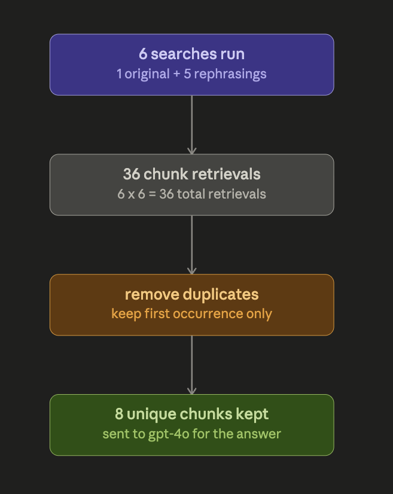

**Queries to test :** 

1. **What was the EBITDA in Q2 ? (non ambiguity)**
2. **"How much profit did the company keep after tax in Q2?" (using ambiguity)**

### First: "6 searches" has nothing to do with k=6 — that's a coincidence

These are two completely separate settings that happen to both be the number 6 in this run:

* **Why 6 searches run** : because you have 6 *queries* — your original question, plus 5 rephrasings. One search per query. This number comes from `NUM_EXPANSIONS = 5` (+1 for the original).
* **Why each search returns 6 chunks** : because `TOP_K = 6` in retriever.py — that's a totally unrelated setting that just says "whenever you search, bring back the top 6 matches."

If you changed `NUM_EXPANSIONS` to 3, you'd see 4 searches run, but each would still return 6 chunks each (unless you also changed `TOP_K`). They're two independent knobs that happen to share the same value right now — that's exactly why it looked like one thing to you. Good instinct to question it.

### Now, new vs duplicate

Think of it like this: you send 6 different people to a library, each with a slightly different way of phrasing the same question. Each person comes back holding 6 books. You lay all the books on one table — but if two people brought back the  *same exact book* , you only want one copy on your table, not two.

So for every book (chunk) that comes back, you ask: "Is this exact book already on my table?"

* If no → put it on the table, mark it `NEW`.
* If yes → don't add a second copy, mark it `duplicate`.

That's the whole rule. It's just checking "have I already collected this exact piece of text" — nothing fancier.

### Walking through your actual run

* **Query 1 (original)** : first person back from the library — the table is empty, so all 6 books they brought are automatically `NEW`. Table now has 6 books.
* **Query 2 (expansion 1)** : this person phrased it differently, but the library still handed them the *same* 6 books as before. All 6 are already on the table → `0 new`, all marked `duplicate`.
* **Query 3 (expansion 2)** : 5 of their books were already on the table (`duplicate`), but they also brought back one book nobody else had — the operational metrics table → `1 new`. Table now has 7 books.
* **Query 4** : same story as query 2, all 6 already on the table → `0 new`.
* **Query 5 (expansion 4)** : brought back one more book nobody had yet — the report's title page → `1 new`. Table now has 8 books.
* **Query 6** : everything it found was already on the table → `0 new`.

Add it up:  **6 + 0 + 1 + 0 + 1 + 0 = 8 unique books ended up on the table** , out of 36 total book-fetches across all 6 trips (6 people × 6 books each). That's exactly your line: *"Merged result: 8 unique chunk(s) after deduplication across 6 queries."* Those 8 chunks are what actually got handed to GPT-4o to write the final answer — the other 28 fetches were just the same content being re-found and thrown away.

### What each file actually is

| File                             | What it does                                                                                                                                                                                                                | Do you run it?                                                                                                                                                                                                  |
| -------------------------------- | --------------------------------------------------------------------------------------------------------------------------------------------------------------------------------------------------------------------------- | --------------------------------------------------------------------------------------------------------------------------------------------------------------------------------------------------------------- |
| **`ingest.py`**          | Reads your 3 PDFs, chunks them, embeds them, saves the FAISS index to disk.                                                                                                                                                 | Run **once** , before anything else. Only re-run if you change the PDFs.                                                                                                                                 |
| **`retriever.py`**       | Loads the saved index and knows*how*to search it (how many chunks, which model). Every other file borrows this — it doesn't do its own thing.                                                                            | Not usually — it's a support file the others lean on.                                                                                                                                                          |
| **`answer_chain.py`**    | Knows how to turn a pile of chunks into a final written answer (the prompt, the GPT-4o call). Also just a support file.                                                                                                     | **Never run this one directly**— it has no`main()`, no entry point. It exists purely so`reranker.py`and`query_expansion.py`don't each need their own separate copy of "how to generate an answer." |
| **`reranker.py`**        | Retrieves chunks for one query (plain search, no expansion) → shows you **BEFORE**(original order) → shows you **AFTER**(reranked with scores) → generates and prints the **final answer** . | **Yes — run this one.**                                                                                                                                                                                  |
| **`query_expansion.py`** | The full pipeline: expand your question into 6 phrasings → search 6 times → merge/dedupe → rerank → generate the final answer.                                                                                          | Yes — run this too, but as your "everything together" demo.                                                                                                                                                    |

### My suggested run order : 

1. `python ingest.py` — once, before the session even starts, so you're not waiting on it live.
2. `python reranker.py` — **this is your before/after reranking demo.** Clean, isolated, shows exactly what you asked for.
3. `python query_expansion.py` — right after, as the "now let's combine it with query expansion too" finale, showing the full recall (expansion) + precision (reranking) + answer pipeline together.
